### Hi I'm Ian

Currently Dual Majoring in Computer Science & Finance at the University of Waterloo.  
Interested in anything related to problem solving — ML, Systems, Research, Games, Puzzles, etc.

**Coding Languages:** &nbsp;       

**Tools:** &nbsp;         

---

### Stats:

<table border="0"><tr>
<td valign="top"></td>
<td valign="top"></td>
</tr></table>

  
